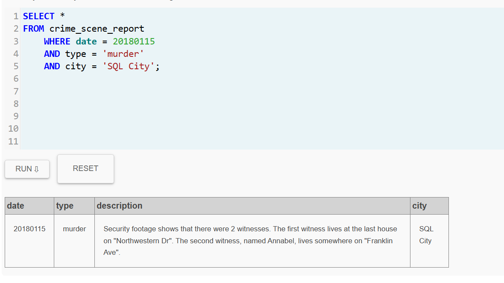

# SQL Murder Mystery – Reporte de Investigación
## Datos del Detective

**Actividad:** SQL Murder Mystery  
**Nombre:** Carol Juliana Henao  

---

## Resumen del Caso

El asesinato ocurrido el 15 de enero de 2018 en SQL City fue investigado utilizando consultas SQL sobre diferentes tablas de la base de datos.

La investigación permitió identificar primero al asesino Jeremy Bowers, quien fue visto huyendo del lugar del crimen y coincidía con las pistas proporcionadas por los testigos.

Posteriormente, al revisar su testimonio, se descubrió que él fue contratado por otra persona para cometer el crimen. Analizando las características descritas (mujer pelirroja, conductora de Tesla Model S y asistente frecuente a conciertos de SQL Symphony), se identificó a la verdadera culpable:

 **Miranda Priestly**

---

 ## Bitácora de Investigación
 A continuación se documenta paso a paso el proceso seguido para resolver el misterio.
 
---
### Paso 1: Buscar el reporte del crimen

```sql
SELECT *
FROM crime_scene_report
WHERE date = 20180115
AND type = 'murder'
AND city = 'SQL City';
```
Explicación

Se buscó el reporte del crimen ocurrido el 15 de enero de 2018 en SQL City.
El reporte indicó que existían dos testigos clave:

Uno vive en la última casa de Northwestern Dr
Otro se llama Annabel y vive en Franklin Ave



---
###Paso 2: Encontrar al primer testigo
```sql
SELECT *
FROM person
WHERE address_street_name = 'Northwestern Dr'
ORDER BY address_number DESC
LIMIT 1;
```
Explicación

Se buscó la última casa de Northwestern Dr ordenando los números de dirección de mayor a menor.
Resultado: Morty Schapiro
